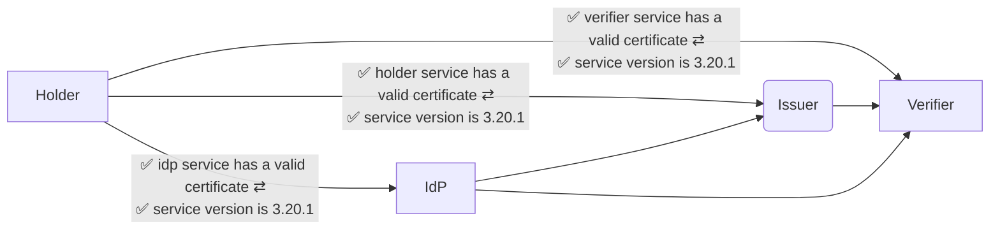
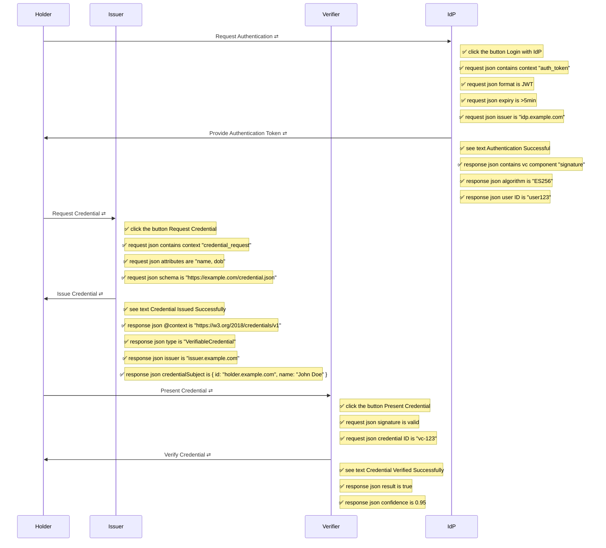
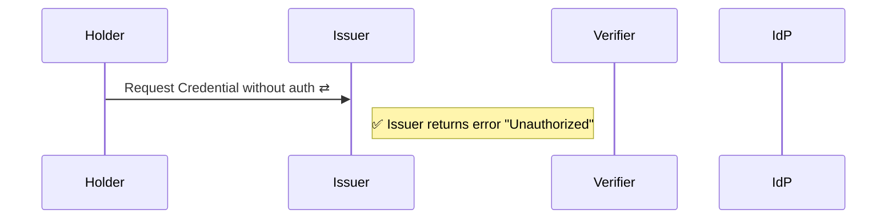
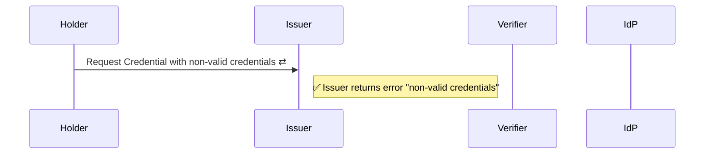
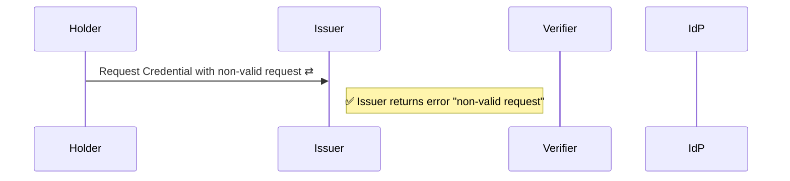
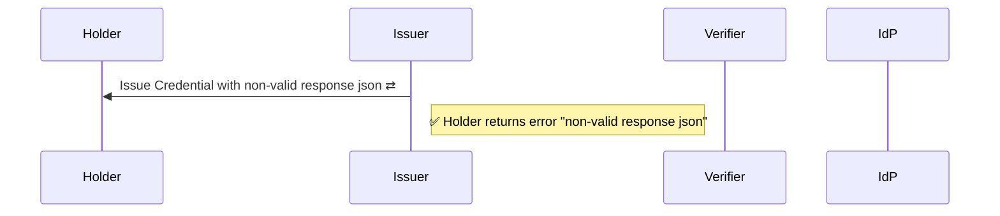
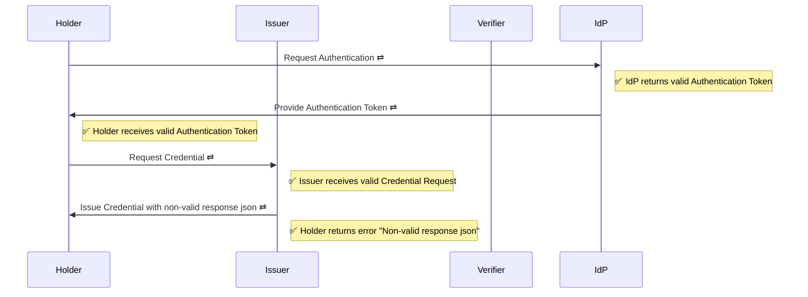

# ✅ Issue and Verify Testing

* Version: 3.20.1
* Date: 2025-08-04 13:20:20
* Duration: 29s

## ✅ System Components

Components of the verifiable credentials system and their interconnections.

    ✅ No network requests are made outside components
    ✅ All compenents are tested
     

## ✅ Complete Verifiable Credentials Workflow

A standard verifiable credential issuance, presentation, and verification flow with authentication via an Identity Provider. This flow ensures that a holder can successfully request and receive a credential from an issuer, present it to a verifier, and have it successfully verified, all while authenticating through an external IdP.

## ✅ Unauthorized Access Tests

This diagram tests that the services cannot be accessed without authentication.

## ✅ Non-valid Credentials Tests

This diagram tests that the services return an error when accessed with non-valid credentials.

## ✅ Non-valid Requests Tests

This diagram tests that the services return an error when accessed with non-valid requests.

## ✅ Non-valid Response JSON Tests

This diagram tests that the services return an error when the response json is non-valid.

## ✅ Issue token with Non-valid request

This diagram tests that the services return an error after login where the credential is not valid.

